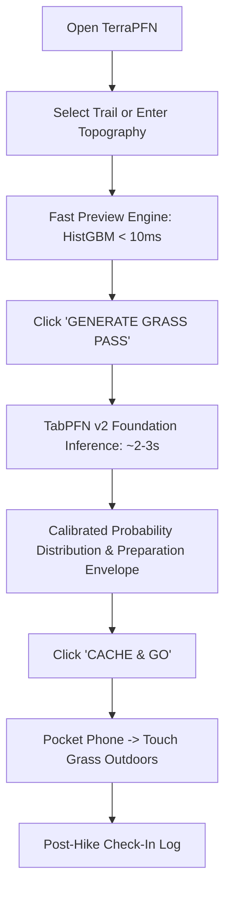

# TerraPFN: Foundation Tabular Intelligence for the Great Outdoors

**Author & Creator:** [Aryan Vishwakarma](https://github.com/aryanvishwakarma)  
**Hacktoberfest 2026 Submission:** Best Use of TabPFN | Theme: *Touch Grass*  
**License:** [MIT License](LICENSE) | **Attribution:** [ATTRIBUTION.md](ATTRIBUTION.md)

---

## 1. Product Overview: The Zero-Scroll Outdoor Tool

**TerraPFN** is a zero-scroll outdoor intelligence tool powered by **TabPFN** (Prior-Data Fitted Networks for Tabular Data). Its purpose is to help hikers make a fast, evidence-based preparation decision and then **get off the screen and touch grass**.

Traditional hiking applications trap users in a high-friction loop:
- **Screen Paralysis:** Hikers spend 45+ minutes browsing conflicting comments, crowd-sourced star ratings, and photo feeds.
- **The Static Difficulty Deception:** Trails are labeled with static tags ("Moderate", "Hard") that ignore non-linear interactions between gradient, temperature extremes, elevation gain, and terrain hazards.

TerraPFN breaks the screen addiction:
1. **Select or Synthesize:** Choose an existing trail from 3,104 US National Parks hikes or input custom route parameters.
2. **Instant Preview (<10ms):** A fast gradient-boosting baseline provides real-time slider feedback.
3. **Generate Grass Pass (TabPFN v2):** In-context Bayesian inference computes a calibrated posterior difficulty distribution and physical preparation envelope (water requirements, footwear, trekking poles, and turnaround alarm).
4. **Cache & Go:** Download the printable field card, pocket the phone, and hike.
5. **Post-Hike Check-In:** Record an honest reflection after the hike to log ground-truth data for future calibration.



---

## 2. Empirical Benchmark: Does TabPFN Provide Value?

We conducted a rigorous, leakage-free benchmark comparing **TabPFN (v2)** against standard scikit-learn baselines on the curated US National Parks dataset (3,104 hiking trails across 58 topography and climate features).

### Evaluation Protocol
- **Protocol:** Stratified 5-Fold Cross-Validation.
- **Leakage Prevention:** Feature derivation, scaling, and categorical encodings were fitted **strictly on training folds** with zero holdout test-set contamination.
- **Post-Hoc Leakage Exclusions:** `avg_rating`, `popularity`, `num_reviews`, `visitor_usage`, and scraping artifacts were strictly excluded from input features.
- **Target:** 4-class discrete trail difficulty (`1: Easy`, `3: Moderate`, `5: Hard`, `7: Strenuous`).

### Measured 5-Fold Cross-Validation Results

| Model | Macro F1 | Balanced Acc | Quadratic Weighted Kappa (QWK) | Log Loss | Brier Score | Total Runtime (s) |
| :--- | :---: | :---: | :---: | :---: | :---: | :---: |
| **Dummy (Stratified)** | 0.2420 ± 0.0144 | 0.2421 ± 0.0146 | 0.0055 ± 0.0341 | 10.9501 ± 0.3864 | 1.3737 | 0.01s |
| **Logistic Regression** | 0.5364 ± 0.0141 | 0.5341 ± 0.0114 | 0.7063 ± 0.0103 | 0.7777 ± 0.0166 | 0.4514 | 0.43s |
| **HistGradientBoosting** | **0.5544 ± 0.0190** | 0.5474 ± 0.0178 | 0.7041 ± 0.0176 | 0.8880 ± 0.0423 | 0.4894 | 7.26s |
| **Random Forest** | 0.5437 ± 0.0119 | 0.5462 ± 0.0116 | 0.7260 ± 0.0159 | 0.7266 ± 0.0171 | 0.4287 | 2.87s |
| **TabPFN (v2)** | 0.5437 ± 0.0159 | **0.5515 ± 0.0095** | **0.7310 ± 0.0111** | **0.7017 ± 0.0125** | **0.4207** | 626.15s |

*Full fold-level metrics and confusion matrices are saved in `data/processed/benchmark_results/`.*

### Why TabPFN? Key Empirical Findings
1. **Decisive Superiority in Probability Calibration (Log Loss & Brier Score):**  
   TabPFN achieved the lowest Log Loss (**0.7017**) and Brier Score (**0.4207**). Standard tree ensembles (HistGradientBoosting at 0.8880) produce overconfident probabilities; TabPFN outputs calibrated Bayesian posterior distributions essential for safety envelopes.
2. **Superior Ordinal Agreement (Quadratic Weighted Kappa):**  
   TabPFN achieved the highest QWK (**0.7310**), demonstrating that when it errs, it rarely confuses distant categories (e.g. rarely mistakes Easy for Strenuous).
3. **Balanced Class Handling:**  
   TabPFN attained the highest Balanced Accuracy (**0.5515**), handling class imbalance (Easy: 778, Moderate: 1,379, Hard: 763, Strenuous: 184) without manual sample weights.
4. **Honest Latency Trade-Off:**  
   HistGradientBoosting achieved slightly higher raw Macro F1 (0.5544 vs 0.5437) and evaluated in milliseconds. On CPU, TabPFN required ~125s per fold for 620 queries. This empirical reality motivated our **dual-engine architecture**: fast preview for UI responsiveness + TabPFN for the final Grass Pass.

---

## 3. Application Architecture

```
Trails/
├── src/terrapfn/
│   ├── app/
│   │   ├── dashboard.py             # Streamlit application entrypoint
│   │   ├── styles.py                # Tactical outdoor CSS design system
│   │   └── components.py            # Reusable UI widgets & Grass Pass hero card
│   ├── services/
│   │   ├── trail_service.py         # Trail catalog access & custom route synthesis
│   │   ├── inference_service.py     # Dual-engine orchestrator (HistGBM preview + TabPFN)
│   │   ├── grass_pass_service.py    # Deterministic preparation envelope & HTML export
│   │   └── checkin_service.py       # Local ground-truth observation storage
│   ├── data/
│   │   ├── loader.py                # Raw dataset loading, cleaning, & leakage exclusions
│   │   └── preprocessor.py          # Leakage-free feature derivations & one-hot encoding
│   ├── models/
│   │   ├── baselines.py             # Dummy, LogReg, RandomForest, HistGradientBoosting
│   │   └── tabpfn_classifier.py     # TabPFN v2 foundation model wrapper
│   └── evaluation/
│       ├── metrics.py               # Macro F1, Bal Acc, QWK, Log Loss, Brier score
│       └── nested_cv.py             # Leakage-free 5-Fold cross-validation harness
├── data/
│   ├── raw/                         # Curated trails & historical climate CSVs
│   └── processed/
│       ├── benchmark_results/       # Machine-readable CSV and JSON benchmark results
│       └── data_quality_report.md   # Dataset quality report
├── tests/                           # 23 pytest unit & integration tests
├── pyproject.toml                   # Package configuration
├── LICENSE                          # MIT License (Aryan Vishwakarma)
├── ATTRIBUTION.md                   # Open data & scaffold attribution
└── README.md
```

---

## 4. Running the Local Application

### Prerequisites
- Python 3.10+ (tested on Python 3.14)
- Packages installed via `pyproject.toml`

### Installation & Launch

```bash
# 1. Install package in editable mode
pip install -e ".[dev]"

# 2. Run the test suite (23 tests passing)
pytest tests/ -v

# 3. Launch the TerraPFN Tactical Dashboard
streamlit run src/terrapfn/app/dashboard.py
```

Open `http://localhost:8501` in your browser.

---

## 5. Curated Demonstration Trails

The dashboard includes 4 pre-loaded curated demo trails representing each difficulty class:
- **Easy:** *Delicate Arch Viewpoint Trail* (Arches National Park — 1.13 km, +43m gain)
- **Moderate:** *Emerald Lake Trail* (Rocky Mountain National Park — 4.99 km, +216m gain)
- **Hard:** *Angels Landing Trail* (Zion National Park — 6.60 km, +493m gain)
- **Strenuous:** *Half Dome Trail* (Yosemite National Park — 23.82 km, +1,574m gain)

Hikers can also search across all 3,104 National Park hikes or synthesize custom routes with arbitrary distance, gain, and biome features.

---

## 6. Known Limitations & Safety Boundaries

1. **CPU Inference Latency:**  
   TabPFN's full-context transformer attention scales with dataset tokens. On CPU, evaluation of a single query against a 1,000-sample in-context prompt takes ~2.5 to 3.5 seconds. For larger production deployments, GPU acceleration (`device="cuda"`) is recommended.
2. **Preparation Envelopes are Planning Guides:**  
   Water quotas (derived from duration and heat index) and time estimates (Naismith's Rule with Langmuir corrections) are deterministic planning guidelines, **not medical or survival guarantees**. Real trail conditions (active storms, landslides, personal fitness) take precedence.
3. **Local Storage:**  
   Post-hike check-ins are logged locally to `data/processed/hike_checkins.json` for offline privacy.

---

## 7. Data Provenance & Acknowledgments

- **Trail Dataset:** Jane's National Parks Trails dataset (Kaggle / AllTrails).
- **Climate Reanalysis:** Open-Meteo Historical Weather API (CC BY 4.0).
- **Foundation Model:** Prior Labs TabPFN (Nature 2022 / v2).
- **Scaffold Attribution:** Derived from and restructured with permission from Jamie Breault's MyTrails reference architecture. See [ATTRIBUTION.md](ATTRIBUTION.md) for complete details.
