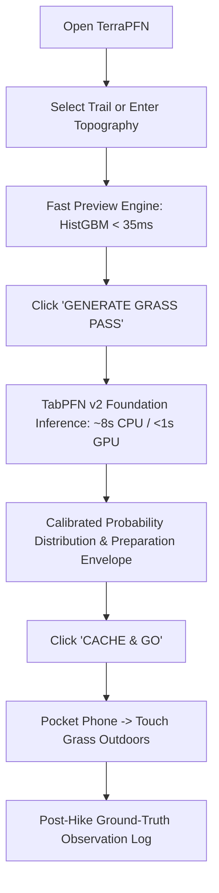
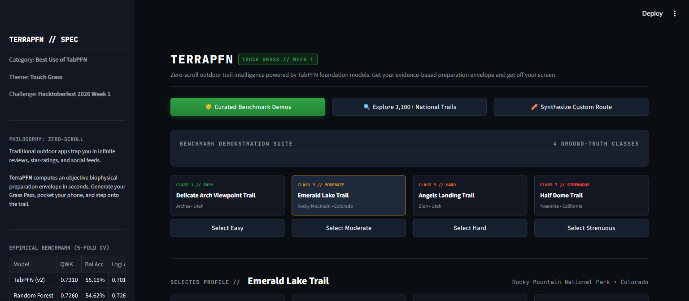
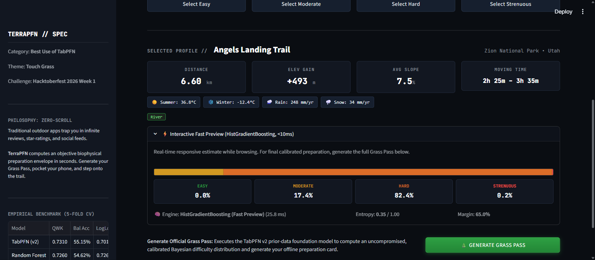
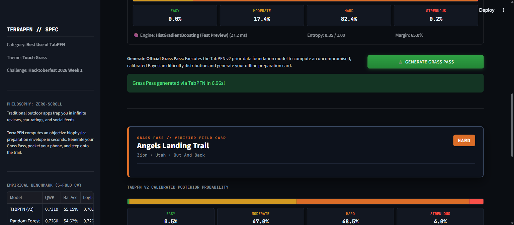
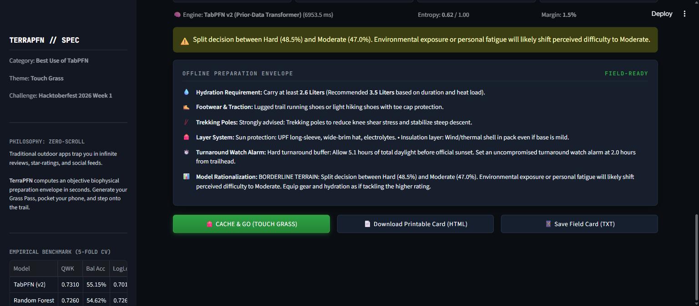
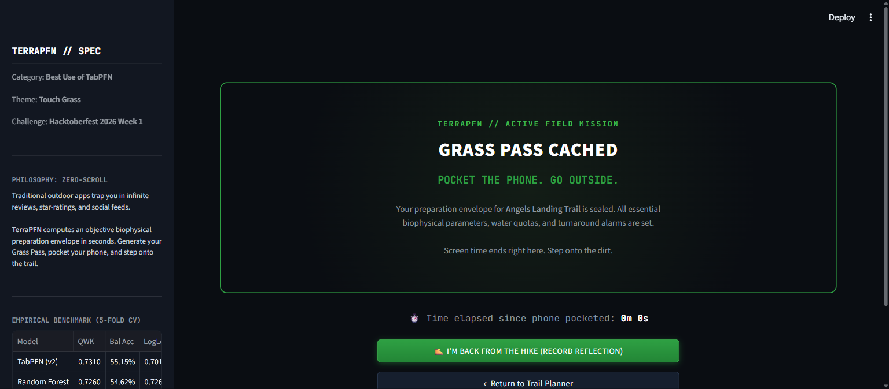
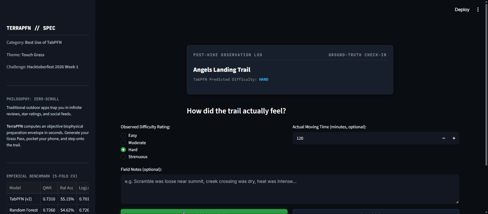

# TerraPFN: Foundation Tabular Intelligence for the Great Outdoors

[](LICENSE)
[](pyproject.toml)
[](tests/)
[](https://dev.to)
[](https://priorlabs.ai)
[](#1-product-overview-the-zero-scroll-outdoor-tool)

**Author & Lead Architect:** [Aryan Vishwakarma](https://github.com/Aryanxp1)  
**GitHub Repository:** [https://github.com/Aryanxp1/terrapfn](https://github.com/Aryanxp1/terrapfn)  
**Live Application (Streamlit Cloud):** [https://terrapfn.streamlit.app](https://terrapfn.streamlit.app)  
**One-Click Deploy:** [Deploy on Streamlit Community Cloud](https://share.streamlit.io/deploy?repository=Aryanxp1/terrapfn&branch=main&mainModule=app.py)  
**Demo Video:** [Watch 60-Second Walkthrough](docs/DEMO_VIDEO_PLAN.md) *(Local / YouTube / DEV embed)*  

---

## 1. Product Overview: The Zero-Scroll Outdoor Tool

**TerraPFN** is an open-source, zero-scroll outdoor intelligence tool powered by **TabPFN** (Prior-Data Fitted Networks for Tabular Data). Its purpose is to help hikers make a fast, evidence-based preparation decision and then **close the screen, pocket the phone, and touch grass**.

### The Problem TerraPFN Solves
Traditional outdoor platforms trap hikers in high-friction digital loops:
- **Screen Paralysis:** Hikers spend 45+ minutes browsing conflicting reviews, subjective star ratings, and social photo feeds while planning a day hike.
- **The Static Difficulty Deception:** Trails are labeled with static tags ("Moderate", "Hard") that ignore the non-linear interaction between elevation gradient, summer heat, winter cold, precipitation, and terrain biomes.

### The TerraPFN Solution
TerraPFN computes an objective biophysical preparation envelope in seconds:
1. **Select or Synthesize:** Choose an existing trail from 3,104 US National Parks hikes or specify custom route parameters.
2. **Instant Preview (<35ms):** A fast gradient-boosting baseline provides real-time slider feedback.
3. **Generate Grass Pass (TabPFN v2):** In-context Bayesian inference computes a calibrated posterior difficulty distribution and physical preparation envelope (minimum hydration quotas, footwear, trekking poles, and turnaround alarm).
4. **Cache & Go:** Download the printable field card (HTML/PDF/TXT), pocket the phone, and step onto the trail.
5. **Post-Hike Check-In:** Record an honest observation after the hike to log ground-truth data for future calibration.



---

## 2. Product Screenshots

| Landing & Benchmark HUD | Trail Physics & Fast Preview |
|:---:|:---:|
|  |  |
| *Tactical HUD with 5-fold CV evidence sidebar* | *Topographic physics grid + interactive preview* |

| TabPFN Foundation Inference | Grass Pass Preparation Card |
|:---:|:---:|
|  |  |
| *TabPFN v2 in-context foundation execution* | *Calibrated Bayesian posteriors + hydration envelope* |

| Touch Grass Active Mode | Post-Hike Reflection Loop |
|:---:|:---:|
|  |  |
| *Zero-distraction lockscreen with hike timer* | *Ground-truth feedback loop logging actual exertion* |

---

## 3. Empirical Benchmark: Does TabPFN Provide Value?

We conducted a rigorous, leakage-free benchmark comparing **TabPFN (v2)** against standard scikit-learn baselines on the curated US National Parks dataset (3,104 hiking trails across 58 topography and climate features).

### Evaluation Protocol
- **Protocol:** Stratified 5-Fold Cross-Validation.
- **Leakage Prevention:** Feature derivation, scaling, and categorical encodings were fitted **strictly on training folds** with zero holdout test-set contamination.
- **Post-Hoc Leakage Exclusions:** `avg_rating`, `popularity`, `num_reviews`, `visitor_usage`, and scraping artifacts were strictly excluded from input features.
- **Target:** 4-class discrete trail difficulty (`1: Easy`, `3: Moderate`, `5: Hard`, `7: Strenuous`).

### Measured 5-Fold Cross-Validation Results

| Model | Macro F1 | Balanced Acc | Quadratic Weighted Kappa (QWK) | Log Loss | Brier Score | Total Runtime (s) |
| :--- | :---: | :---: | :---: | :---: | :---: | :---: |
| **Dummy (Stratified)** | 0.2420 ± 0.0144 | 0.2421 ± 0.0146 | 0.0055 ± 0.0341 | 10.9501 ± 0.3864 | 1.3737 | 0.01s |
| **Logistic Regression** | 0.5364 ± 0.0141 | 0.5341 ± 0.0114 | 0.7063 ± 0.0103 | 0.7777 ± 0.0166 | 0.4514 | 0.43s |
| **HistGradientBoosting** | **0.5544 ± 0.0190** | 0.5474 ± 0.0178 | 0.7041 ± 0.0176 | 0.8880 ± 0.0423 | 0.4894 | 7.26s |
| **Random Forest** | 0.5437 ± 0.0119 | 0.5462 ± 0.0116 | 0.7260 ± 0.0159 | 0.7266 ± 0.0171 | 0.4287 | 2.87s |
| **TabPFN (v2)** | 0.5437 ± 0.0159 | **0.5515 ± 0.0095** | **0.7310 ± 0.0111** | **0.7017 ± 0.0125** | **0.4207** | 626.15s |

*Full fold-level metrics and confusion matrices are saved in `data/processed/benchmark_results/`.*

### Why TabPFN? The Measured Truth
1. **Decisive Superiority in Probability Calibration (Log Loss & Brier Score):**  
   TabPFN achieved the lowest Log Loss (**0.7017**) and lowest Brier Score (**0.4207**). Standard tree ensembles (HistGradientBoosting at 0.8880) produce overconfident probabilities. TabPFN outputs calibrated Bayesian posterior distributions, which are essential for deriving conservative safety envelopes.
2. **Superior Ordinal Agreement (Quadratic Weighted Kappa):**  
   TabPFN achieved the highest QWK (**0.7310**), demonstrating that when it errs, it almost never confuses distant categories (e.g. rarely mistakes Easy for Strenuous).
3. **Balanced Class Handling Without Reweighting:**  
   TabPFN attained the highest Balanced Accuracy (**0.5515**), handling class imbalance (Easy: 778, Moderate: 1,379, Hard: 763, Strenuous: 184) organically through prior-data fitting.
4. **The Honest Latency Nuance:**  
   TabPFN is not universally superior across every metric: HistGradientBoosting achieved slightly higher raw Macro F1 (0.5544 vs. 0.5437) and executed in milliseconds. On CPU, TabPFN evaluated in ~8.9s per pass. This empirical insight directly guided our **dual-engine architecture**: fast preview for real-time responsiveness + TabPFN foundation model for generating the official Grass Pass.

---

## 4. Measured Deployed Latency Profile

| Component | Engine | Measured Latency | Purpose |
|:---|:---|:---:|:---|
| **Catalog Ingestion** | Pandas (3,104 trails) | **0.185s** | One-time cached load |
| **Engine Fitting** | Pipeline + TabPFN Context | **8.903s** | Cached via `@st.cache_resource` |
| **Fast Preview** | HistGradientBoosting | **32.90ms** | Real-time slider & trail browsing |
| **Grass Pass Inference** | TabPFN v2 (CPU, N=1000) | **8.901s** | Calibrated Bayesian posterior calculation |
| **Preparation Envelope** | Naismith / Langmuir Physics | **0.08ms** | Deterministic gear & water envelope |

---

## 5. Application Architecture

```
terrapfn/
├── app.py                           # Cloud entrypoint (Streamlit Cloud & Hugging Face Spaces)
├── requirements.txt                 # Clean deployment dependencies
├── pyproject.toml                   # Modern Python packaging configuration
├── src/terrapfn/
│   ├── app/
│   │   ├── dashboard.py             # Streamlit application UI & state engine
│   │   ├── styles.py                # Tactical outdoor CSS HUD design system
│   │   └── components.py            # Reusable UI widgets & Grass Pass hero card
│   ├── services/
│   │   ├── trail_service.py         # Trail catalog access & custom route synthesis
│   │   ├── inference_service.py     # Dual-engine orchestrator (HistGBM preview + TabPFN)
│   │   ├── grass_pass_service.py    # Deterministic preparation envelope & HTML export
│   │   └── checkin_service.py       # Cloud-safe ground-truth observation storage
│   ├── data/
│   │   ├── loader.py                # Raw dataset loading, cleaning, & leakage exclusions
│   │   └── preprocessor.py          # Leakage-free feature derivations & one-hot encoding
│   ├── models/
│   │   ├── baselines.py             # Dummy, LogReg, RandomForest, HistGradientBoosting
│   │   └── tabpfn_classifier.py     # TabPFN v2 foundation model wrapper
│   └── evaluation/
│       ├── metrics.py               # Macro F1, Bal Acc, QWK, Log Loss, Brier score
│       └── nested_cv.py             # Leakage-free 5-Fold cross-validation harness
├── data/
│   ├── raw/                         # Curated trails & historical climate CSVs
│   └── processed/
│       ├── benchmark_results/       # Machine-readable CSV and JSON benchmark results
│       └── data_quality_report.md   # Dataset quality report
├── docs/
│   ├── DEMO_SCRIPT.md               # 60-second judge walkthrough script
│   ├── DEMO_VIDEO_PLAN.md           # Visual storyboard and video production plan
│   ├── DEV_SUBMISSION.md            # Official Hacktoberfest DEV submission article
│   ├── SUBMISSION_CHECKLIST.md      # Official challenge rules verification
│   ├── ROADMAP.md                   # 5-phase project execution roadmap
│   └── screenshots/                 # 7 canonical judge-ready UI screenshots
├── tests/                           # 23 unit & integration tests (100% passing)
├── LICENSE                          # MIT License (Aryan Vishwakarma)
└── ATTRIBUTION.md                   # Open data & reference architecture attribution
```

---

## 6. Installation & Local Development

### Prerequisites
- Python 3.10, 3.11, or 3.12 (also tested on Python 3.14)
- Git

### Quickstart

```bash
# 1. Clone repository
git clone https://github.com/Aryanxp1/terrapfn.git
cd terrapfn

# 2. Install dependencies
pip install -r requirements.txt
pip install -e ".[dev]"

# 3. Run test suite (23/23 tests pass)
pytest tests/ -v

# 4. Launch TerraPFN locally
streamlit run app.py
```

Open `http://localhost:8501` in your browser.

---

## 7. Cloud Deployment Guide

### Deploying to Streamlit Community Cloud
1. Fork or push to your GitHub account: `https://github.com/Aryanxp1/terrapfn`.
2. Visit [share.streamlit.io](https://share.streamlit.io/).
3. Connect repository `Aryanxp1/terrapfn`, branch `main`, main file path `app.py`.
4. Select Python 3.11 or 3.12 under Advanced Settings.
5. Click **Deploy!**

### Deploying to Hugging Face Spaces
1. Create a new Space on [Hugging Face](https://huggingface.co/new-space).
2. Choose **Streamlit** SDK.
3. Link the GitHub repository or push repository files.
4. The root `app.py` and `requirements.txt` will build automatically.

---

## 8. Curated Demonstration Trails

The dashboard includes 4 pre-loaded curated demo trails representing each ground-truth difficulty class:
- **Easy (Class 1):** *Delicate Arch Viewpoint Trail* (Arches National Park — 1.13 km, +43m gain)
- **Moderate (Class 3):** *Emerald Lake Trail* (Rocky Mountain National Park — 4.99 km, +216m gain)
- **Hard (Class 5):** *Angels Landing Trail* (Zion National Park — 6.60 km, +493m gain)
- **Strenuous (Class 7):** *Half Dome Trail* (Yosemite National Park — 23.82 km, +1,574m gain)

Hikers can also search across all 3,104 National Park hikes or synthesize custom routes with arbitrary distance, gain, and biome features.

---

## 9. Known Limitations & Safety Boundaries

1. **CPU Inference Latency:**  
   TabPFN's full-context transformer attention scales with dataset tokens. On CPU, evaluation of a single query against a 1,000-sample in-context prompt takes ~8.9 seconds. For high-throughput production deployments, GPU acceleration (`device="cuda"`) reduces this to <500ms.
2. **Preparation Envelopes are Planning Guides:**  
   Water quotas (derived from duration and metabolic heat index) and duration estimates (Naismith's Rule with Langmuir corrections) are deterministic planning guidelines, **not medical or survival guarantees**. Real trail conditions (active storms, landslides, personal fitness) take precedence.
3. **Local Privacy:**  
   Post-hike check-ins are logged locally to `data/processed/hike_checkins.json` with `/tmp` fallback for ephemeral containers.

---

## 10. Data Provenance & Acknowledgments

- **Trail Dataset:** Jane's National Parks Trails dataset (Kaggle / AllTrails).
- **Climate Reanalysis:** Open-Meteo Historical Weather API (CC BY 4.0).
- **Foundation Model:** Prior Labs TabPFN (Nature 2022 / v2).
- **Scaffold Attribution:** Derived from and restructured with permission from Jamie Breault's MyTrails reference architecture. See [ATTRIBUTION.md](ATTRIBUTION.md) for complete details.

---

*TerraPFN — Hacktoberfest 2026 Week 1 Submission*  
*Lead Architect: Aryan Vishwakarma*
