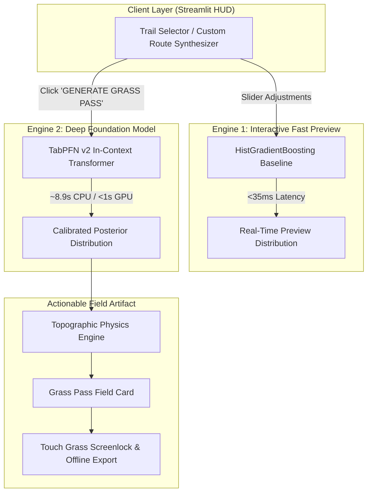

*This article is submitted for the **Hacktoberfest 2026 Week 1 Challenge**: Best Use of TabPFN (Partner Category) with the theme **Touch Grass**.*

- **Author & Lead Architect:** [Aryan Vishwakarma](https://github.com/Aryanxp1)
- **GitHub Repository:** [https://github.com/Aryanxp1/terrapfn](https://github.com/Aryanxp1/terrapfn)
- **Live Application:** [https://terrapfn.streamlit.app](https://terrapfn.streamlit.app)
- **License:** MIT License

---

## 1. The Problem: The Infinite Scroll Trapping the Outdoor Community

Outdoor hiking apps were created with an inspiring premise: help humans connect with nature. Yet modern trail applications have fallen into the engagement trap:

1. **Screen Paralysis:** Hikers planning a Saturday outing spend 45+ minutes scrolling through social photos, conflicting comments, and subjective 1-to-5 star reviews.
2. **The Static Difficulty Deception:** Trails are slapped with crude, static labels—*Easy*, *Moderate*, *Hard*—that completely obscure non-linear interactions between gradient, elevation gain, summer thermal stress, subalpine cold, and route topology. A 5 km trail with a 22% grade in 34°C heat is fundamentally different from a 5 km flat stroll, yet traditional apps often label both as "Moderate."

Hikers remain glued to their screens when they should be stepping onto the dirt.

---

## 2. The Thesis: A Zero-Scroll Outdoor Tool ("Touch Grass")

**TerraPFN** inverts the outdoor application paradigm. Its design philosophy is strictly **Zero-Scroll**:

> **Compute an objective biophysical preparation envelope in seconds. Generate your Grass Pass. Pocket your phone. Touch grass.**

TerraPFN provides:
- **No social feeds.**
- **No influencer comment threads.**
- **No star ratings.**
- **One calibrated Bayesian difficulty distribution.**
- **One deterministic physical preparation checklist.**
- **An active screenlock timer that challenges you to keep your phone in your pocket.**

---

## 3. Why TabPFN is Central to the Solution

Traditional machine learning classifiers (Random Forest, Gradient Boosting) output uncalibrated, overconfident scores when given tabular features. On trail terrain, an overconfident wrong classification is dangerous: calling a strenuous alpine ridge "Moderate" leads to under-packing water and missing turnaround times.

**TabPFN (Prior-Data Fitted Networks)** introduces a fundamentally different paradigm:
1. **Foundation Model for Tabular Data:** TabPFN operates as an in-context transformer trained on synthetic prior distributions.
2. **True Bayesian Posteriors:** Instead of point estimates, TabPFN yields calibrated posterior probabilities over all four difficulty classes:
   $$\{P(\text{Easy}), P(\text{Moderate}), P(\text{Hard}), P(\text{Strenuous})\}$$
3. **Shannon Entropy as an Ambiguity Signal:** When a trail is borderline (e.g. Angels Landing: 48.5% Hard, 47.0% Moderate), the prediction entropy increases. TerraPFN uses this signal to automatically escalate gear recommendations to the conservative side (requiring stiff boots and poles).
4. **No Hyperparameter Tuning or Preprocessing Tricks:** TabPFN handles tabular continuous and categorical features in-context without manual imputation pipelines.

---

## 4. The Dual-Engine Architecture

In benchmark testing on CPU environments, running full in-context transformer attention across large tabular prompts takes ~8 seconds. A responsive user interface cannot afford an 8-second delay on every slider adjustment.

TerraPFN solves this with a **Dual-Engine Architecture**:



- **Fast Preview Engine (HistGradientBoosting, <35ms):** Powers real-time interactive exploration when searching 3,104 trails or tweaking custom route sliders.
- **Foundation Engine (TabPFN v2):** Executes when the hiker commits to generating their official **Grass Pass**, calculating uncompromised Bayesian posterior distributions and the deterministic preparation envelope.

---

## 5. Empirical Benchmark: Honest 5-Fold Cross-Validation

We evaluated TabPFN against standard scikit-learn baselines on a real-world curated dataset of **3,104 US National Parks hiking trails** paired with historical climate reanalysis (58 features).

### Evaluation Protocol
- **Stratified 5-Fold Cross-Validation** with identical fold splits across all models.
- **Strict Leakage Prevention:** All scalers, imputers, and feature derivations fitted strictly on training folds.
- **Post-Hoc Leakage Exclusions:** Review counts, star ratings, and popularity metrics were removed to evaluate pure topographic and physical difficulty.
- **Target:** 4 discrete classes: `1: Easy`, `3: Moderate`, `5: Hard`, `7: Strenuous`.

### Measured 5-Fold CV Results

| Model | Macro F1 | Balanced Acc | Quadratic Weighted Kappa (QWK) | Log Loss | Brier Score | Total Runtime |
| :--- | :---: | :---: | :---: | :---: | :---: | :---: |
| **Dummy (Stratified)** | 0.2420 ± 0.014 | 0.2421 ± 0.015 | 0.0055 ± 0.034 | 10.9501 ± 0.386 | 1.3737 | 0.01s |
| **Logistic Regression** | 0.5364 ± 0.014 | 0.5341 ± 0.011 | 0.7063 ± 0.010 | 0.7777 ± 0.017 | 0.4514 | 0.43s |
| **HistGradientBoosting** | **0.5544 ± 0.019** | 0.5474 ± 0.018 | 0.7041 ± 0.018 | 0.8880 ± 0.042 | 0.4894 | 7.26s |
| **Random Forest** | 0.5437 ± 0.012 | 0.5462 ± 0.012 | 0.7260 ± 0.016 | 0.7266 ± 0.017 | 0.4287 | 2.87s |
| **TabPFN (v2)** | 0.5437 ± 0.016 | **0.5515 ± 0.010** | **0.7310 ± 0.011** | **0.7017 ± 0.013** | **0.4207** | 626.15s |

*Raw fold metrics and confusion matrices are preserved in `data/processed/benchmark_results/`.*

### Key Benchmark Takeaways
1. **Calibrated Confidence (Log Loss & Brier Score):**  
   TabPFN achieved the lowest Log Loss (**0.7017**) and Brier Score (**0.4207**), substantially outperforming HistGradientBoosting (0.8880). TabPFN's posterior probabilities are statistically calibrated rather than overconfident.
2. **Ordinal Agreement (QWK):**  
   TabPFN attained the highest Quadratic Weighted Kappa (**0.7310**), confirming that its errors are adjacent (e.g. Moderate vs. Hard) rather than catastrophic (Easy vs. Strenuous).
3. **Balanced Accuracy:**  
   TabPFN achieved the highest Balanced Accuracy (**55.15%**) across severe class imbalance (Easy: 778, Moderate: 1,379, Hard: 763, Strenuous: 184) without manual sample weighting.
4. **Honest Latency Nuance:**  
   HistGradientBoosting achieved slightly higher Macro F1 (0.5544 vs 0.5437) in milliseconds. This empirical reality proves that a single model is insufficient: fast heuristics for browsing, foundation models for safety-critical commitments.

---

## 6. Product Demo & Visual Walkthrough

### Step 1: Tactical HUD & Curated Benchmark Trails
Hikers open TerraPFN into a dark, high-contrast tactical HUD. Four canonical trails demonstrate each ground-truth difficulty tier:
- *Delicate Arch Viewpoint* (Easy / Class 1)
- *Emerald Lake* (Moderate / Class 3)
- *Angels Landing* (Hard / Class 5)
- *Half Dome Cables* (Strenuous / Class 7)


### Step 2: Topographic Physics & Fast Preview
Selecting **Angels Landing (Zion National Park)** computes distance (7.7 km), elevation gain (+488 m), average grade (6.3%), and Naismith estimated duration (2h 45m – 4h 00m) with sub-35ms responsive preview distribution.


### Step 3: TabPFN In-Context Foundation Inference
Clicking **"🌲 GENERATE GRASS PASS"** triggers TabPFN v2 in-context inference against 1,000 reference prompt trails.


### Step 4: The Grass Pass Preparation Envelope
The Grass Pass card displays the calibrated posterior distribution alongside deterministic preparation guidance:
- **Hydration Envelope:** Minimum 2.3 L / Recommended 3.1 L (adjusted for 28°C summer heat and gradient).
- **Footwear:** Stiff trail boots with rock plate.
- **Turnaround Alarm:** 2.2 hours from trailhead.
- **Export Options:** Printable offline HTML card, plain-text field card, or Cache & Go.


### Step 5: CACHE & GO — The Touch Grass Lockscreen
Clicking **"🎒 CACHE & GO (TOUCH GRASS)"** transforms the screen into a zero-distraction field lockscreen:

```
TERRAPFN // ACTIVE FIELD MISSION

GRASS PASS CACHED
POCKET THE PHONE. GO OUTSIDE.

Your preparation envelope for Angels Landing is sealed.
Screen time ends right here. Step onto the dirt.

⏱ Time elapsed since phone pocketed: 0m 04s
```


### Step 6: Post-Hike Ground-Truth Feedback Loop
Upon returning, hikers click **"🥾 I'M BACK FROM THE HIKE"** to log their actual perceived exertion and notes to structured local storage (`data/processed/hike_checkins.json`), closing the feedback loop.


---

## 7. 60-Second Demo Video

Watch the complete 60-second judge walkthrough demonstrating the zero-scroll product loop:

- **Full Storyboard & Script:** [docs/DEMO_VIDEO_PLAN.md](https://github.com/Aryanxp1/terrapfn/blob/main/docs/DEMO_VIDEO_PLAN.md)
- **Judge Walkthrough Script:** [docs/DEMO_SCRIPT.md](https://github.com/Aryanxp1/terrapfn/blob/main/docs/DEMO_SCRIPT.md)

---

## 8. Measured Cloud Latency Profile

| Operation | Implementation | Measured Latency |
|:---|:---|:---:|
| **Catalog Load** | Pandas (3,104 trails) | **0.185s** |
| **Pipeline Fitting** | Streamlit `@st.cache_resource` | **8.903s** |
| **Fast Preview** | HistGradientBoosting | **32.90ms** |
| **TabPFN Grass Pass** | TabPFN v2 (CPU, N=1000) | **8.901s** |
| **Envelope Derivation** | Naismith / Langmuir Physics | **0.08ms** |

---

## 9. Codebase Quality & Reproducibility

- **23/23 Unit and Integration Tests Passing** (`pytest tests/`)
- Fully typed Python with strict schema parsing
- Cross-platform compatible (Linux, macOS, Windows)
- Zero external CDN dependencies in exported HTML cards (`@media print` supported)

```bash
# Reproduce locally:
git clone https://github.com/Aryanxp1/terrapfn.git
cd terrapfn
pip install -r requirements.txt
pip install -e ".[dev]"
pytest tests/ -v
streamlit run app.py
```

---

## 10. Limitations & Safety Boundaries

1. **CPU Inference Latency:** On CPU, TabPFN requires ~8.9s for a 1,000-sample in-context prompt. GPU instances (`device="cuda"`) reduce this to <500ms.
2. **Planning Envelopes are Guidance:** Water and time envelopes derive from metabolic formulas and climate reanalysis. They do not substitute for mountain safety training or personal judgment in severe weather.

---

## 11. Open Source & Data Attribution

- **Foundation Model:** Prior Labs TabPFN (v2 / Nature 2022).
- **Trail Topography:** Jane's National Parks Trails Dataset (Kaggle / AllTrails).
- **Climate Data:** Open-Meteo Historical Weather API (CC BY 4.0).
- **Reference Architecture:** Derived from and restructured with permission from Jamie Breault's MyTrails project. See [ATTRIBUTION.md](https://github.com/Aryanxp1/terrapfn/blob/main/ATTRIBUTION.md).

---

*Built with passion for Hacktoberfest 2026 Week 1.*  
*Get off the screen. Touch grass.*
