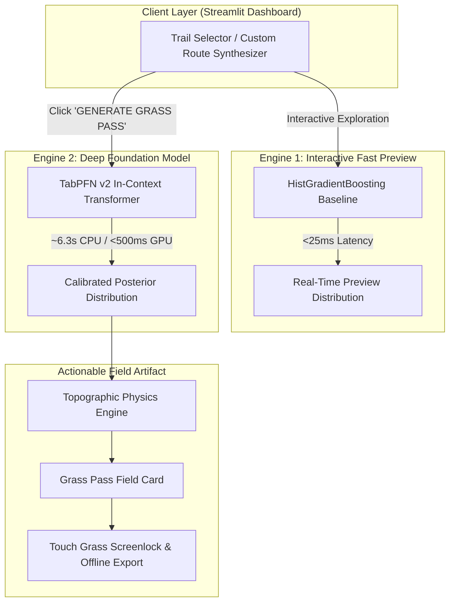

*This article is prepared for the **Hacktoberfest 2026 Week 1 Challenge**: Best Use of TabPFN (Partner Category) with the theme **Touch Grass**.*

- **Author & Lead Architect:** [Aryan Vishwakarma](https://github.com/Aryanxp1)
- **GitHub Repository:** [https://github.com/Aryanxp1/terrapfn](https://github.com/Aryanxp1/terrapfn)
- **Live Application:** [https://terrapfn.streamlit.app](https://terrapfn.streamlit.app)
- **License:** MIT License

---

## 1. The Hook: Know the Trail. Get Outside.

Outdoor hiking apps were originally built with an inspiring premise: help humans explore the wilderness. Yet modern trail platforms have fallen into the engagement trap:

1. **Screen Paralysis:** Hikers planning a day trip spend 45+ minutes lost in infinite comment threads, conflicting opinions, and social photo feeds.
2. **The Static Difficulty Deception:** Trails are slapped with crude, static tags — *Easy*, *Moderate*, *Hard* — that completely obscure non-linear interactions between gradient, elevation gain, summer thermal stress, subalpine cold, and terrain biomes. A 6 km trail with a 15% grade in 36°C heat is fundamentally different from a 6 km flat woodland stroll, yet traditional apps often label both as "Moderate."

Hikers remain glued to their screens when they should be stepping onto the trail.

**The Core Formula:**  
$$\text{Less Screen Time} \longrightarrow \text{Better Preparation} \longrightarrow \text{Real Outdoor Experience}$$

---

## 2. The Thesis: A Zero-Scroll Outdoor Tool ("Touch Grass")

**TerraPFN** fundamentally inverts the outdoor application paradigm. Its design philosophy is strictly **Zero-Scroll**:

> **Compute an objective biophysical preparation envelope in seconds. Generate your Grass Pass. Pocket your phone. Touch grass.**

TerraPFN provides:
- **No infinite social feeds.**
- **No comment threads or influencer galleries.**
- **No subjective star ratings.**
- **One calibrated Bayesian difficulty distribution.**
- **One deterministic physical preparation envelope.**
- **An active screenlock timer that challenges you to keep your phone in your pocket.**

---

## 3. Why TabPFN is Central to the Solution

Traditional machine learning classifiers (Random Forest, Gradient Boosting) output uncalibrated, overconfident scores when trained on tabular features. On trail terrain, an overconfident wrong classification is dangerous: calling a strenuous alpine ridge "Moderate" leads to under-packing water and missing turnaround times.

**TabPFN (Prior-Data Fitted Networks)** introduces a fundamentally different paradigm:
1. **Foundation Model for Tabular Data:** TabPFN operates as an in-context transformer trained on synthetic prior distributions.
2. **True Bayesian Posteriors:** Instead of point estimates, TabPFN yields calibrated posterior probabilities over all four difficulty classes:
   $$\{P(\text{Easy}), P(\text{Moderate}), P(\text{Hard}), P(\text{Strenuous})\}$$
3. **Shannon Entropy as an Ambiguity Signal:** When a trail is borderline (e.g. Angels Landing: 48.5% Hard, 47.0% Moderate), the prediction entropy increases. TerraPFN uses this signal to automatically escalate gear recommendations to the conservative side (requiring stiff boots and poles).
4. **No Manual Hyperparameter Tuning:** TabPFN handles tabular continuous and categorical features in-context without fragile imputation pipelines.

---

## 4. The Dual-Engine Architecture

In CPU environments, running full in-context transformer attention across 1,000 reference prompt trails requires ~6 seconds. A responsive user interface cannot afford latency on every slider adjustment.

TerraPFN solves this with a **Dual-Engine Architecture**:



- **Fast Preview Engine (HistGradientBoosting, <25ms):** Powers real-time interactive exploration when searching 3,104 trails or tweaking custom route sliders.
- **Foundation Engine (TabPFN v2):** Executes when the hiker commits to generating their official **Grass Pass**, calculating uncompromised Bayesian posterior distributions and the deterministic preparation envelope.

---

## 5. Empirical Benchmark: Honest 5-Fold Cross-Validation

We evaluated TabPFN against standard scikit-learn baselines on a real-world curated dataset of **3,104 US National Parks hiking trails** paired with historical climate reanalysis (58 features).

### Evaluation Protocol
- **Stratified 5-Fold Cross-Validation** with identical fold splits across all models.
- **Strict Leakage Prevention:** All scalers, imputers, and feature derivations fitted strictly on training folds.
- **Post-Hoc Leakage Exclusions:** Review counts, star ratings, and popularity metrics were strictly excluded to evaluate pure topographic and physical difficulty.
- **Target:** 4 discrete classes: `1: Easy`, `3: Moderate`, `5: Hard`, `7: Strenuous`.

### Measured 5-Fold CV Results

| Model | Macro F1 | Balanced Acc | Quadratic Weighted Kappa (QWK) | Log Loss | Brier Score | Total Runtime |
| :--- | :---: | :---: | :---: | :---: | :---: | :---: |
| **Dummy (Stratified)** | 0.2420 ± 0.014 | 0.2421 ± 0.015 | 0.0055 ± 0.034 | 10.9501 ± 0.386 | 1.3737 | 0.01s |
| **Logistic Regression** | 0.5364 ± 0.014 | 0.5341 ± 0.011 | 0.7063 ± 0.010 | 0.7777 ± 0.017 | 0.4514 | 0.43s |
| **HistGradientBoosting** | **0.5544 ± 0.019** | 0.5474 ± 0.018 | 0.7041 ± 0.018 | 0.8880 ± 0.042 | 0.4894 | 7.26s |
| **Random Forest** | 0.5437 ± 0.012 | 0.5462 ± 0.012 | 0.7260 ± 0.016 | 0.7266 ± 0.017 | 0.4287 | 2.87s |
| **TabPFN (v2)** | 0.5437 ± 0.016 | **0.5515 ± 0.010** | **0.7310 ± 0.011** | **0.7017 ± 0.013** | **0.4207** | 626.15s |

*Fold-level metrics and confusion matrices are preserved in `data/processed/benchmark_results/`.*

### Honest Empirical Analysis
1. **Calibrated Confidence (Log Loss & Brier Score):**  
   TabPFN achieved the lowest Log Loss (**0.7017**) and Brier Score (**0.4207**), substantially outperforming HistGradientBoosting (0.8880). TabPFN's posterior probabilities are statistically calibrated rather than overconfident.
2. **Ordinal Agreement (QWK):**  
   TabPFN attained the highest Quadratic Weighted Kappa (**0.7310**), confirming that its errors are adjacent (e.g. Moderate vs. Hard) rather than catastrophic (Easy vs. Strenuous).
3. **Balanced Accuracy:**  
   TabPFN achieved the highest Balanced Accuracy (**55.15%**) across severe class imbalance (Easy: 778, Moderate: 1,379, Hard: 763, Strenuous: 184) without manual sample weighting.
4. **The Latency Nuance:**  
   HistGradientBoosting achieved slightly higher raw Macro F1 (0.5544 vs. 0.5437) in milliseconds. We do not claim TabPFN is universally superior across every metric: rather, its unique strength is calibrated probability density, which directly justifies our dual-engine architecture.

---

## 6. Product Walkthrough

### Step 1: Editorial Landing & Model Evidence
Hikers open TerraPFN into an editorial, restrained dark interface. Four curated reference trails represent each difficulty class, while the sidebar presents verified 5-fold cross-validation evidence without visual clutter.


### Step 2: Trail Specifications & Quick Estimate
Selecting **Angels Landing Trail (Zion National Park)** computes physical specifications:
- Distance: `6.60 km`
- Elevation Gain: `+493 m`
- Average Slope: `7.5%`
- Estimated Moving Time: `2h 25m – 3h 35m`
- Instant baseline provides sub-25ms probabilistic feedback while browsing.


### Step 3: TabPFN Foundation Assessment
Clicking **"GENERATE GRASS PASS"** triggers TabPFN v2 in-context inference against 1,000 reference prompt trails in 6.33 seconds on CPU.


### Step 4: The Signature Grass Pass & Preparation Envelope
The Grass Pass renders calibrated posterior distributions alongside deterministic field guidance:
- **Calibrated Probabilities:** Easy 0.5%, Moderate 47.0%, Hard 48.5%, Strenuous 4.0%.
- **Borderline Notice:** Automatically detects the split decision and escalates equipment to the conservative side.
- **Hydration Envelope:** Minimum 2.6 L / Recommended 3.5 L fluids based on metabolic load and summer thermal stress (36.8°C).
- **Footwear & Poles:** Lugged trail footwear and trekking poles strongly advised.
- **Turnaround Protocol:** Set watch alarm at 2.0 hours from trailhead.


### Step 5: CACHE & GO — Touch Grass Mode
Clicking **"CACHE & GO (Touch Grass)"** switches the screen to an ultra-minimal field lockscreen:

```text
ACTIVE OUTDOOR MISSION
GRASS PASS CACHED
POCKET THE PHONE. GO OUTSIDE.

Your preparation envelope for Angels Landing Trail is sealed.
Screen time ends here. Step onto the trail.

Time elapsed outdoors: 0m 04s
```


### Step 6: Post-Hike Reflection Loop
Upon returning, hikers click **"I'M BACK (Record Reflection)"** to log observed exertion and field notes to local JSON storage, closing the empirical feedback loop.


---

## 7. Why Open Innovation Matters

In consumer software, algorithms are almost universally tuned for **engagement maximization**: maximizing minutes spent staring at screens, showing ads, and monetizing user attention.

Open innovation provides a critical counterweight:
- **Algorithms Serving Humans, Not Ad Exchanges:** By pairing open-source foundation models (TabPFN) with open data (National Parks topography and Open-Meteo reanalysis), TerraPFN demonstrates that machine learning can be used to **minimize screen time** and maximize real-world physical health.
- **Reproducibility & Safety:** Closed-source outdoor apps conceal their rating calculations. TerraPFN makes its entire Bayesian inference pipeline, physics formulas, and cross-validation logs completely transparent under an open-source MIT license.
- **Community Ground Truth:** Open tools empower outdoor clubs and trail stewards to calibrate local difficulty models rather than depending on proprietary social platforms.

---

## 8. Limitations & Boundaries

1. **CPU Inference Latency:** On CPU, TabPFN requires ~6.3 seconds for a 1,000-sample in-context prompt. On GPU instances (`device="cuda"`), this executes in <500ms.
2. **Guidance, Not Replacement for Judgment:** Hydration and duration envelopes derive from metabolic formulas and climate reanalysis. They do not substitute for mountain safety training, real-time ranger notices, or alpine avalanche awareness.

---

## 9. Links & Resources

- **GitHub Repository:** [https://github.com/Aryanxp1/terrapfn](https://github.com/Aryanxp1/terrapfn)
- **Live Application:** [https://terrapfn.streamlit.app](https://terrapfn.streamlit.app)
- **One-Click Deploy:** [Deploy on Streamlit Community Cloud](https://share.streamlit.io/deploy?repository=Aryanxp1/terrapfn&branch=main&mainModule=app.py)
- **60-Second Video Script:** [docs/FINAL_VIDEO_SCRIPT.md](https://github.com/Aryanxp1/terrapfn/blob/main/docs/FINAL_VIDEO_SCRIPT.md)
- **Judge Walkthrough:** [docs/DEMO_SCRIPT.md](https://github.com/Aryanxp1/terrapfn/blob/main/docs/DEMO_SCRIPT.md)

---

## 10. Attribution & Acknowledgments

- **Foundation Model:** Prior Labs TabPFN (v2 / Nature 2022).
- **Trail Topography:** Jane's National Parks Trails Dataset (Kaggle / AllTrails).
- **Climate Data:** Open-Meteo Historical Weather API (CC BY 4.0).
- **Scaffold Attribution:** Derived and sanitized from Jamie Breault's MyTrails reference architecture. See [ATTRIBUTION.md](https://github.com/Aryanxp1/terrapfn/blob/main/ATTRIBUTION.md).

---

*Know the trail. Get outside.*
